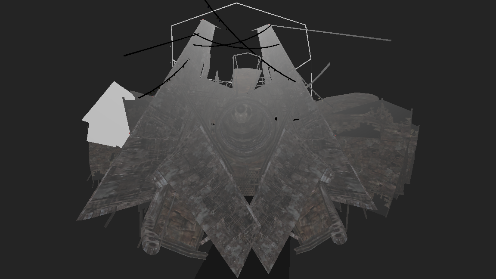

# Fallout 3: Re Engine

Fallout 3をRedot Engineで再構成する実験的なプロジェクトです。
ゲームアセットなどは内蔵しておらず、オリジナルゲームデータを直接使用します。

---

## 最近の更新

### 2026-06-21: NIFマテリアル αチャンネル改善 + 地形座標解決 + ドキュメント整備

1. **NIFMaterialBuilder  α検出の拡張**: αチャンネル検出を Diffuse スロットだけでなく Glow/Skin/Hair, Height/Parallax スロットでも行うよう拡張。透過マテリアルに CullMode.Disabled（両面描画）を適用。
2. **地形 LAND 座標解決の改善**: ESMReader の BuildLandCoordinateMap が Cell Children GRUPs を正しく処理し、LAND レコードの座標マッピング精度を向上。
3. **LAND BTXT 検証**: TerrainBuilder が BTXT（ベーステクスチャ）のない LAND レコードをスキップ。プレースホルダ地形の誤生成を防止。
4. **ドキュメント追加**: `Assets/project.md` にプロジェクト構造概要と回転/変換の数理的基盤を文書化。

---

## 実装

- [x] 環境構築
- [x] ESMの読み込み
- [x] NFIの読み込み
- [x] モデルの読み込み
- [x] パーティクルの読み込み
- [x] メガトンの町を読み込み
- [x] 他の場所にも対応
- [x] 地形の読み込み
- [x] テクスチャの読み込み
- [x] シェーダーマテリアルシステム（15/18タイプ実装）
- [x] ライティング（セル・オブジェクト・シャドウマップ）
- [x] 衝突物理（Havok→Godot物理変換）
- [x] スキニング/アニメーション基盤
- [x] パーティクルシステム（BSStripParticleSystem→GPUParticles3D）
- [x] 地形LOD（9x9簡略メッシュ＋距離切替）
- [x] 複数ワールドスペース対応（F1-F9切替）
- [x] 全26レコードタイプ対応
- [x] 非同期ワールドローディング＋キャッシング
- [x] フラスタムカリング＋インスタンスプーリング
- [x] 設定ファイル（config.json）外部化
- [x] NAVMESH 解析＋NavigationRegion3D 生成
- [x] Havok 物理パラメータ（摩擦・反発）マッピング
- [x] SCOL パーツ配置（ONAM+DATA パース）
- [x] デバッグ表示（FPS, カメラ位置, キャッシュ統計）
